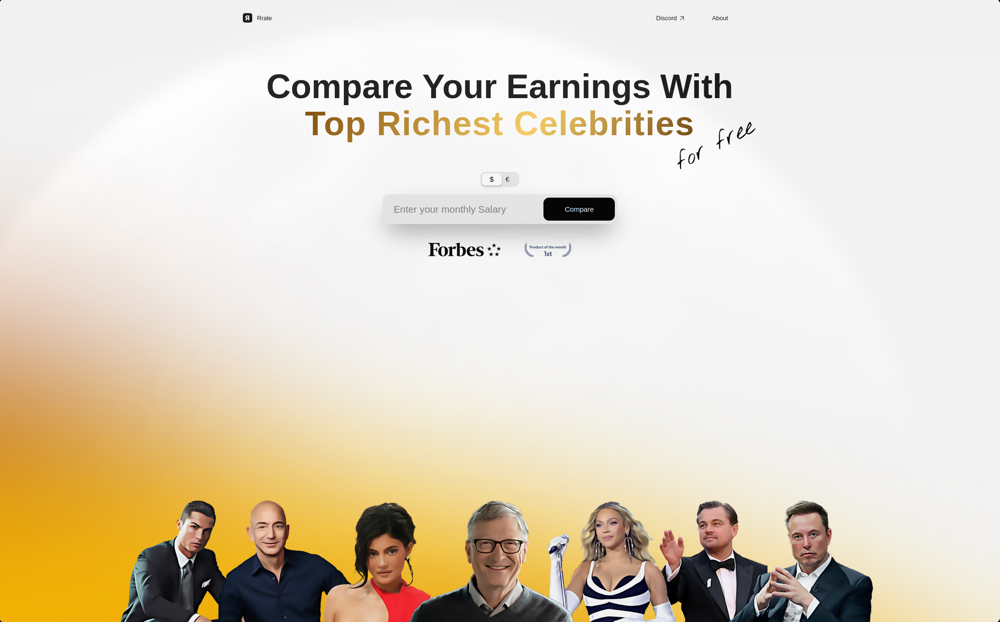

# Rrate 💰

**Compare Your Earnings With Top Richest Celebrities**

Rrate is a fun, interactive web application that allows users to compare their salary with the world's wealthiest celebrities and entrepreneurs. Discover fascinating insights about wealth inequality through engaging visualizations and comparisons.

🌐 **[Try it now - it's online!](your-website-url)**

## ✨ Features

- **Salary Comparison**: Enter your monthly salary and see how it stacks up against billionaires
- **Celebrity Selection**: Choose from 40+ wealthy personalities including Elon Musk, Jeff Bezos, Taylor Swift, and more
- **Interactive Visualizations**: 
  - Animated donut charts showing wealth proportions
  - Bar charts comparing your wealth to country GDPs
  - Real-time counters showing celebrity earnings while you browse
- **Fun Comparisons**: Discover how long it would take celebrities to buy jets, apartments, or vacations
- **Responsive Design**: Works seamlessly on desktop and mobile devices
- **Multi-currency Support**: Toggle between USD ($) and EUR (€)

## 🚀 Live Demo

Visit [Rrate](your-website-url) to try the comparison tool yourself!

## 📸 Screenshots



## 🛠️ Technology Stack

- **Frontend**: HTML5, CSS3, JavaScript (ES6+)
- **Charts**: Chart.js for data visualizations
- **Animations**: CountUp.js for number animations
- **Storage**: LocalStorage for user data persistence
- **Analytics**: Google Analytics integration

## 📁 Project Structure

```
rrate/
├── index.html              # Landing page
├── pages/
│   ├── selection.html      # Celebrity selection page
│   └── result.html         # Results and comparisons page
├── css/
│   ├── reset.css          # CSS reset
│   ├── style.css          # Main styles
│   ├── style-result.css   # Results page styles
│   ├── style-selection.css # Selection page styles
│   ├── header.css         # Header component styles
│   └── style-footer.css   # Footer component styles
├── js/
│   ├── landing.js         # Landing page functionality
│   ├── selection.js       # Celebrity selection logic
│   ├── result.js          # Results page logic
│   ├── fieldSalary.js     # Salary calculations
│   ├── graph.js           # Chart configurations
│   ├── header.js          # Header interactions
│   └── popup.js           # Modal/popup functionality
└── images/                # Assets and celebrity photos
```

## 🎯 How It Works

1. **Enter Your Salary**: Input your monthly salary on the landing page
2. **Select Currency**: Choose between USD or EUR
3. **Pick a Celebrity**: Browse through our curated list of wealthy individuals
4. **Explore Comparisons**: View detailed breakdowns including:
   - Time it takes for the celebrity to earn your salary
   - Apartment sizes you could afford vs. them
   - Vacation duration comparisons
   - Fun purchases (jets, phones, etc.)

## 🔧 Installation & Setup

1. Clone the repository:
```bash
git clone https://github.com/yourusername/rrate.git
cd rrate
```

2. Open `index.html` in your browser or serve with a local server:
```bash
# Using Python
python -m http.server 8000

# Using Node.js
npx serve .

# Using PHP
php -S localhost:8000
```

3. Navigate to `http://localhost:8000` in your browser

## 📊 Celebrity Database

The app includes data for 40+ celebrities and entrepreneurs across various industries:

- **Tech**: Elon Musk, Jeff Bezos, Bill Gates, Mark Zuckerberg
- **Entertainment**: Taylor Swift, Beyoncé, Leonardo DiCaprio
- **Sports**: Cristiano Ronaldo, LeBron James, Lionel Messi
- **Fashion**: Bernard Arnault, Kylie Jenner
- **And many more...**

## 🎨 Key Features Breakdown

### Interactive Charts
- **Donut Chart**: Visual representation of wealth proportion
- **Bar Chart**: Comparison with country GDPs
- **Real-time Counter**: Live earnings tracker

### Engaging Comparisons
- Private jet purchase time
- Real estate affordability in NYC
- Vacation duration in Maldives
- Charity impact analysis

### Responsive Design
- Mobile-first approach
- Hamburger navigation for small screens
- Touch-friendly interactions

## 🤝 Contributing

Contributions are welcome! Please feel free to submit a Pull Request. For major changes, please open an issue first to discuss what you would like to change.

1. Fork the project
2. Create your feature branch (`git checkout -b feature/AmazingFeature`)
3. Commit your changes (`git commit -m 'Add some AmazingFeature'`)
4. Push to the branch (`git push origin feature/AmazingFeature`)
5. Open a Pull Request

## 📝 License

This project is licensed under the MIT License - see the [LICENSE](LICENSE) file for details.

## 👨‍💻 Author

**Haziel**
- Twitter: [@Haziel_o_o_](https://x.com/Haziel_o_o_)
- GitHub: [HazielCancino](https://github.com/HazielCancino)
- Instagram: [@Haziel_o_o_](https://www.instagram.com/Haziel_o_o_/)

## 🙏 Acknowledgments

- Forbes for wealth data inspiration
- Chart.js for beautiful visualizations
- All the celebrities who inspire (and sometimes shock) us with their wealth

---

*"You've still got a few minutes left on your coffee break to dream about it. ☕️"*

**Made with ♥ by Haziel (and not with $ unfortunately)**